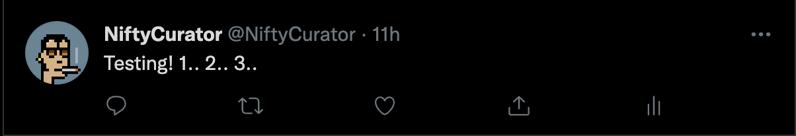

# nifty-curator-bot
Bot that runs the @niftycurator account on Twitter. 

# How to send your first tweet!
1. Created an empty repo named Nifty-Curator-Bot. 
2. Cloned repo locally in a directory designated for the project. 
```
git clone https://github.com/ashtilawat23/nifty-curator-bot.git
```
3. Initialized a node application and created a default package.json.
```
npm init -y
```
4. Installed 'dotenv' and 'twitter-api-client'. 
```
npm i dotenv
npm i twitter-api-client
```
5. Created .env.sample file. The values that you need include: 
    - Cosumer API Key
    - Cosumer API Secret
    - Access Token
    - Access Token Secret
6. Created .env file. Copy/pasted values from Twitter Developer Portal.
7. Import twitter-api-client and dotenv into your file.
```
require('dotenv').config()
const {TwitterClient} = require('twitter-api-client')
```
8. Create a TwitterClient using the values in your .env file.
```
const client = new TwitterClient({
    apiKey: process.env.CONSUMER_API_KEY, 
    apiSecret: process.env.CONSUMER_API_SECRET,
    accessToken: process.env.ACCESS_TOKEN,
    accessTokenSecret: process.env.ACCESS_TOKEN_SECRET,
});
```
9. Send your first test tweet using client.tweets.statusesUpdate(). 
```
client.tweets.statusesUpdate({
    status: "Testing! 1.. 2.. 3.."
}).then (res => {
    console.log("Your Tweet was sent!", res)
}).catch (err => {
    console.error(err)
});
```
10. Add "start": "node index.js" to scripts in your package.json. 
```
 "scripts": {
    "test": "echo \"Error: no test specified\" && exit 1",
    "start": "node index.js"
  },
```
11. Run npm start in your terminal inside the nifty-curator-bot directory. 
 